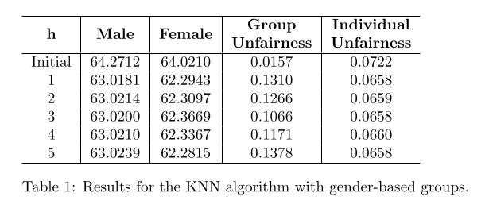
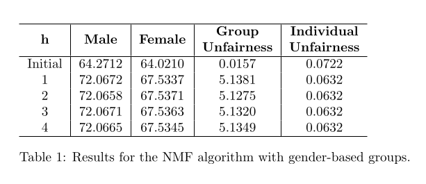

# RecSys_EquityAlgorithm

## Descrição geral
Sistemas de recomendação utilizam-se de dados de interações dos usuários para modelar e prever suas preferências. Uma vez que estes dados não são experimentais, eles normalmente apresentam vieses que geram injustiças nas recomendações.
Tentamos, aqui, implementar as métricas e o algoritmo apresentados pelos pesquisadores **Santos e Comarela (2024)** - artigo disponível em https://sol.sbc.org.br/index.php/wics/article/view/29506 - para avaliar e tentar amenizar a injustiça de recomendações geradas por três algoritmos diferentes em quatro cenários em que os usuários estão divididos de acordo com alguma característica que os une.
A base de dados utilizada para os testes foi a [MovieLens-100k](https://grouplens.org/datasets/movielens/100k/).

A implementação segue um paradigma "ingênuo" no sentido de não utilizar estratégias mais sofisticadas para a clusterização dos usuários e de não adotar otimizações sutis ao algoritmo descrito no artigo. **Portanto, os resultados podem variar se outra implementação for desenvolvida**.

## Cenários considerados
O algoritmo de equidade foi testado para cada algoritmo de recomendação e divisão dos usuários descritos abaixo.

Algoritmos:

* KNN
* SVD
* NMF

Grupos de usuários:

* **Gêneros:**
	* masculino
	* feminino

* **Idade:** 
	* crianças (idade menor do que 12 anos)
	* adolescentes (idade maior ou igual a 12 e menor do que 18 anos)
	* adulto (idade maior ou igual a 18 e menor do que 60 anos)
	* idoso (idade maior do que 60 anos)  

* **Estado (estado de origem dos Estados Unidos):**
	* CA
	* IL
	* MN
	* NY
	* TX
	* Rest (estados com menos de 50 usuários)

* **Popularidade:**
	* Blockbuster (vêem filmes mais populares)
	* Diversificado (vêem filmes diversificados)
	* Nichado (vêem filmes impopulares)

## Métricas utilizadas
Para avaliar a eficiência go algoritmo de equidade, foram utilizadas três métricas sociais:

* **Individual Unfairness ($R_{ind}$):** variação das perdas individuais dos _n_ usuários ($l_{i}$), onde cada perda individual é o erro quadrático médio entre as predições e os _ratings_ verdadeiros das interações conhecidas do usuário

$$R_{ind} = \frac{1}{n^2}\sum_{k=1}^n\sum_{i>k} (l_k - l_i)^2$$

* **Group Losses ($L_i$):** a perda de cada grupo é o erro quadrático médio entre as predições e os _ratings_ verdadeiros das interações conhecidas dos usuários do grupo.

* **Group Unfairness ($R_{grp}$):** variação das perdas dos _g_ grupos

$$R_{grp} = \frac{1}{g^2}\sum_{k=1}^n\sum_{i>k} (L_k - L_i)^2$$

## Resultados
O algoritmo de equidade performou de modo diferente para cada algoritmo: ele demonstrou bastante eficiência para o SVD; eficiência baixa para o KNN; e, no caso do NMF, ele resultou em medidas de injustiça piores dos que as iniciais.
Como exemplo, veja as medidas para o cenário de divisão por gênero:

## Organização

| Diretório | Conteúdo |
| --- | --- |
| source | Classes SocialMeasures e EquityAlgorithm. A primeira calcula as métricas descritas, enquanto que a segunda implementa o algoritmo de equidade abordado no artigo. |
| tests | Classe Test, utilizada para realizar testes automaticamente. Arquivos ages.py, gender.py, popularity.py, states.py, que realizam os testes nos cenários escolhidos. |
| results | Arquivos .tex com as tabelas que armazenam os resultados e os arquivos .pdf com estas tabelas compiladas.
| assets | imagens de exemplo utlizadas no arquivo Readme. |

